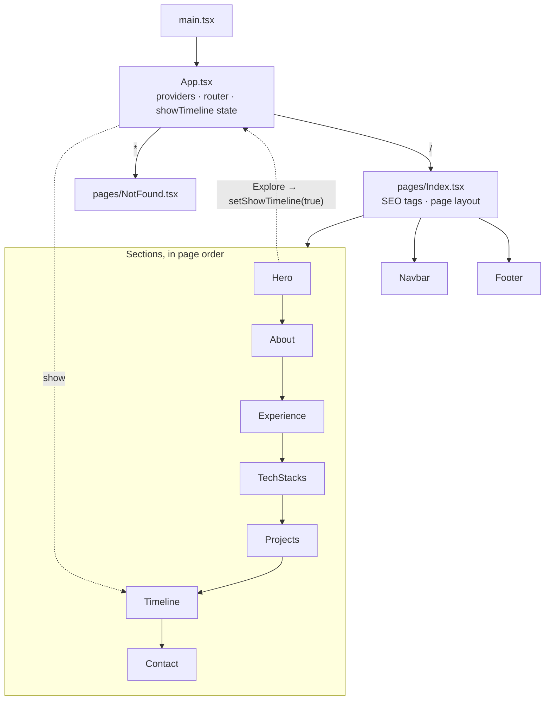

# Akash — Portfolio

The personal portfolio of Akash, an AI developer. It is a single-page React site with a dark charcoal-and-gold theme and GSAP scroll animations. There is no backend: every piece of content is kept in the source, and the site deploys as static files.

## Tech stack

| Area | Choice |
| --- | --- |
| Framework | React 18 + TypeScript, built with Vite 5 (SWC plugin) |
| Styling | Tailwind CSS 3 with HSL CSS-variable tokens; shadcn/ui conventions (Radix primitives, `class-variance-authority`, `tailwind-merge`) |
| Animation | GSAP 3 + ScrollTrigger, plus hand-written CSS effects (no 3D or motion libraries) |
| Routing | React Router 6 |
| Icons | `lucide-react`, plus technology logos from the Devicon and Simple Icons CDNs |
| Contact form | Google Apps Script web app |
| Hosting | Any static host; SPA rewrites are included for Vercel and Netlify |

## Getting started

Requires Node.js 18 or newer.

```bash
npm install
npm run dev       # dev server on http://localhost:8080
npm run build     # production build into dist/
npm run preview   # serve the production build locally
npm run lint      # ESLint
```

### Environment variables

| Variable | Required | Purpose |
| --- | --- | --- |
| `VITE_GOOGLE_APPS_SCRIPT_URL` | No | Endpoint that receives Contact form submissions. If unset, the URL hard-coded in `src/components/sections/Contact.tsx` is used. |

Put it in `.env.local`, which git ignores:

```bash
VITE_GOOGLE_APPS_SCRIPT_URL=https://script.google.com/macros/s/<deployment-id>/exec
```

## Project structure

```text
.
├── index.html                 # Shell: forces dark mode, static SEO/OG tags, preconnects
├── public/                    # Served as-is from the site root
│   ├── akash_profile.jpeg     # Home portrait (also the OG/Twitter image)
│   ├── aboutme.jpeg           # About section backdrop
│   ├── akash_resume.pdf       # Linked from the navbar (RESUME_PATH)
│   ├── icons/                 # Local tech logos not available on the CDNs
│   ├── project_demo/          # Screenshots for in-card project galleries
│   ├── robots.txt, sitemap.xml
│   └── _redirects             # Netlify-style SPA fallback
├── src/
│   ├── main.tsx               # Entry: applies the dark class, mounts <App />
│   ├── App.tsx                # Providers, router, lazy routes, shared Timeline state
│   ├── index.css              # Theme tokens + custom CSS effects
│   ├── pages/
│   │   ├── Index.tsx          # The single page: runtime SEO + section composition
│   │   └── NotFound.tsx       # Catch-all 404
│   ├── components/
│   │   ├── layout/            # Navbar, Footer
│   │   ├── sections/          # Hero, About, Experience, TechStacks, Projects, Timeline, Contact
│   │   └── ui/                # shadcn/ui primitives (button, toast, tooltip, sonner)
│   ├── hooks/use-toast.ts     # shadcn toast store
│   └── lib/
│       ├── motion.ts          # prefersReducedMotion()
│       ├── seo.ts             # Meta, canonical and JSON-LD helpers
│       └── utils.ts           # cn() class merger, RESUME_PATH
├── tailwind.config.ts         # Maps Tailwind colors to the CSS variables
├── vite.config.ts             # Port 8080, "@" → src alias
├── components.json            # shadcn/ui generator config
└── vercel.json                # Vercel SPA rewrite
```

## Architecture

### Boot sequence

1. **`index.html`** adds the `dark` class and paints the charcoal background before any JavaScript runs, so the page never flashes white. It also holds the static SEO and Open Graph tags for crawlers that don't execute JavaScript.
2. **`src/main.tsx`** re-applies the dark class, loads `index.css` and mounts `<App />`.
3. **`src/App.tsx`** wraps the app in its providers (React Query, the Radix tooltip provider, and the toast and Sonner toasters) and a `BrowserRouter`. It lazy-loads the two routes: `/` and a `*` catch-all. The providers are mounted, but no section uses them yet.
4. **`src/pages/Index.tsx`** sets the runtime SEO tags through `lib/seo.ts`: title, description, Open Graph and Twitter tags, the canonical URL, and a schema.org `Person` JSON-LD block. It then renders the navbar, the sections in order, and the footer.



### State

The page keeps almost no shared state. The only value that crosses components is **`showTimeline`**, which lives in `App.tsx`. The Hero's **Explore** button sets it to `true`; `Timeline` renders nothing until then, and afterwards it mounts and the page scrolls to it. Everything else is local component state, such as the active role in Experience, the demo gallery in a project card, and the Contact form fields.

### Content lives in the components

There is no CMS or API. Each section declares its content as a typed array at the top of its own file, so updating the site means editing one of these arrays:

| To change… | Edit |
| --- | --- |
| Home headline and role | `HEADLINE` and `ROLE` in `sections/Hero.tsx` |
| About intro and focus list | `headlineSegments` and `highlights` in `sections/About.tsx` |
| Work history | `experiences` in `sections/Experience.tsx` |
| Skills and logos | `categories` in `sections/TechStacks.tsx` |
| Projects, links and demo screenshots | `projects` in `sections/Projects.tsx` (images go in `public/project_demo/`) |
| Education and career journey | `timelineData` in `sections/Timeline.tsx` |
| Email, phone and location | `sections/Contact.tsx` |
| Navbar links | `NAV_ITEMS` in `layout/Navbar.tsx` |
| Resume file | Replace `public/akash_resume.pdf`, or change `RESUME_PATH` in `lib/utils.ts` |

### Sections

| Section | Anchor | What it does |
| --- | --- | --- |
| **Hero** | top of page | Headline with a character cascade, typewriter role line, and the Explore button. The backdrop is a studio-poster composition (see below). |
| **About** | `#about` | Two-tone intro headline typed out when it scrolls into view, a short summary and a numbered focus list. A hidden "ghost" copy reserves the final layout, so the typing never shifts the page. |
| **Experience** | `#experience` | List of roles; hovering, focusing or clicking one shows its details. |
| **Tech Stacks** | `#tech-stacks` | Skill badges grouped by category, in cards with a running gold "beam" border. |
| **Projects** | `#projects` | Project cards that slide in from alternating sides as you scroll. Projects with `demoImages` open an in-card screenshot gallery (preloaded, auto-advancing, draggable); the others link to live demos. |
| **Timeline** | `#timeline` | Education, career and skills journey. Rendered only after Explore is pressed; the center line draws in on scroll. |
| **Contact** | `#contact` | Contact details and a validated message form. |

### Navigation

`Navbar` is fixed to the top and turns into a glass bar after 50px of scroll. Scroll-spy compares `window.scrollY`, offset by the navbar height, against each section's `offsetTop` to highlight the current link. Clicking a link scrolls to the section with a per-section offset, so headings clear the navbar. A single click on the logo scrolls to the top; a double click reloads the page.

### Animation system

- **GSAP + ScrollTrigger** handle every entrance and scroll animation. Each section creates its tweens inside `gsap.context(…, sectionRef)` and calls `ctx.revert()` on unmount, so no ScrollTriggers leak between mounts.
- **Reduced motion is respected in two places.** Every animation effect returns early when `prefersReducedMotion()` (`lib/motion.ts`) is true, and a global `prefers-reduced-motion` rule in `index.css` shortens all CSS animations and transitions.
- **CSS effects** live in `index.css` as reusable classes: `shimmer-text`, `beam-border`, `flip-card`, `resume-flip`, `reflect-card` and the navbar logo's `collision-*` burst.
- **The stack stays lean on purpose.** GSAP is the only animation dependency; depth and 3D effects use CSS transforms rather than WebGL.

### Home backdrop

The Hero background is the profile photo on the plain dark background, with a double gold "<" chevron to the right of the head, pointing in at the subject's neck.

- All the art is laid out in the **portrait's own coordinate space** (1000 × 1640 units, the photo's aspect ratio). The chevron therefore stays in the same position relative to the subject at every breakpoint. The portrait is 66% of the section wide.
- The chevron is inline SVG (`HeroArrow` in `Hero.tsx`): two nested translucent bands without borders, in a lighter tint of the theme's `--primary` gold (`GOLD`), fading out along the arms, with no glow or lighting effects. The `ARROW` config holds each band's tip position and thickness, plus the fill strength.
- The layers, back to front, are: the photo, the chevron, a solid copy of the "Akash" watermark in the page color, and the faint watermark itself.
  - The photo is `akash_profile.jpeg` at 30% opacity, faded into the background, with a CSS `brightness(1.35)` filter so the face reads clearly without lightening the dark panel. Its black backdrop forms a dark panel that always starts 38.76% across the section and runs to the right edge. From `xl` (1280px) up, the photo slides 11% of the section width left inside that panel, bringing the face closer to the headline, and the panel fills in on the right with the photo's own backdrop color (`#070707`: `#060606` measured along its right edge, brightened to match the filter), so there's no seam. Below `xl` it keeps its original placement. The arrow's `ART_BOX` mirrors the photo's position at both sizes; keep the two in step if you change either.
  - Below the right shoulder, an extra mask shape (`RIGHT_SHOULDER_BLOCK`) hides the chevron's lower arm, so it doesn't reappear beside the barely visible right arm.
  - The "Akash" watermark is centred, with a little left padding to balance its letter-spacing.
  - The chevron sits above the photo so its dark backdrop doesn't dim it. The subject's traced outline (`SILHOUETTE_PATH`) is masked out of it, so it still passes behind the figure. If you replace the portrait, re-trace that outline.
  - The solid watermark copy keeps the letters in front, hiding the chevron wherever it crosses them.
### Theming

The site is dark-only. The colors are HSL CSS variables defined in `src/index.css` (charcoal `--background`, antique-gold `--primary`, glass and gradient tokens). `tailwind.config.ts` maps them to Tailwind color names, so a class like `text-primary` always follows the theme. The `:root` light palette is still defined, but the dark class is always applied.

### Contact form

The form validates on the client: name, mobile number and email are required, the mobile number must have 10 digits and the email must be well-formed. It then `POST`s the fields as JSON, plus a timestamp, to the Google Apps Script web app. The request uses `mode: "no-cors"`, so the response is opaque. The success message appears whenever the request doesn't throw a network error; the site cannot confirm that the script actually stored the submission, so check the script's destination (for example, its Google Sheet) when testing.

### External resources

Tech Stacks logos load from the jsDelivr (Devicon) and Simple Icons CDNs, and `index.html` preconnects to both. If a logo fails to load, the badge falls back to a `lucide-react` icon, and logos missing from the CDNs are served from `public/icons/`.

### SEO

- `index.html` ships static meta tags for non-JS crawlers and link previews.
- `Index.tsx` refreshes the same tags at runtime and adds JSON-LD, using the live `window.location.origin` for the canonical and image URLs.
- `public/robots.txt` and `public/sitemap.xml` are served from the root.

## Deployment

`npm run build` writes a fully static site to `dist/`. The app uses client-side routing, so the host must serve `index.html` for unknown paths. Both common setups are already configured:

- **Vercel:** `vercel.json` rewrites every path to `/`.
- **Netlify** (or any host that reads `_redirects`): `public/_redirects` sends `/*` to `/index.html` with a 200 status.

Set `VITE_GOOGLE_APPS_SCRIPT_URL` in the host's environment settings before building, if you use your own form endpoint.
